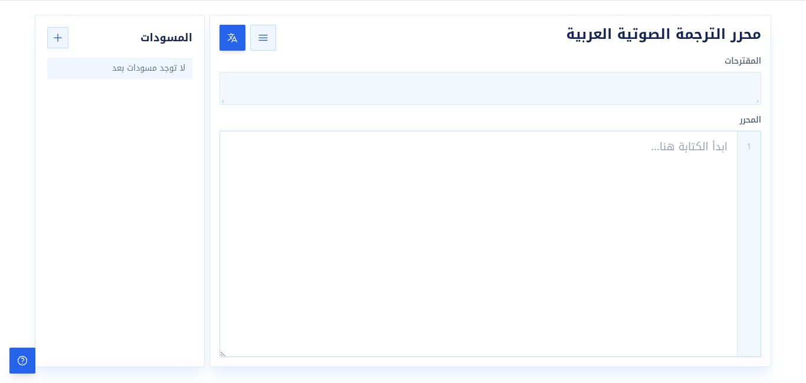

# محرر الترجمة الصوتية العربية

محرر نصوص على الويب يتيح لك الكتابة بالعربية باستخدام الحروف اللاتينية. اكتب الكلمة كما تُنطق (مثل `salam`) وستظهر لك اقتراحات بالحروف العربية (سلام) لتختار منها، بالاعتماد على خدمة Google Input Tools.



## المميزات

- **ترجمة صوتية فورية**: أثناء كتابة أي كلمة بالحروف اللاتينية تظهر الاقتراحات العربية مباشرة في شريط المقترحات.
- **إدراج سريع**: اضغط مسافة أو Enter لقبول الاقتراح الأول، أو انقر على أي اقتراح آخر، واضغط Escape لتجاهل الاقتراحات.
- **تراجع ذكي**: الضغط على Backspace بعد قبول اقتراح يعيد الكلمة اللاتينية الأصلية.
- **مسودات محفوظة تلقائيًا**: تُحفظ النصوص في المتصفح (localStorage) مع قائمة جانبية لفتح المسودات السابقة أو حذفها أو إنشاء مسودة جديدة.
- **تفعيل/إيقاف الترجمة**: بزر في الواجهة أو بالاختصار `Ctrl+M` للكتابة الحرة دون اقتراحات.
- **دليل كتابة**: نافذة صغيرة تعرض أشهر مقابلات الحروف (kh ← خ، sh ← ش، 3a ← ع...).
- **أرقام الأسطر** وواجهة عربية كاملة من اليمين إلى اليسار.

## التقنيات المستخدمة

- HTML وJavaScript خام (بدون إطار عمل أو خطوة بناء)
- [Tailwind CSS](https://tailwindcss.com) عبر CDN مع خط [Noto Kufi Arabic](https://fonts.google.com/noto/specimen/Noto+Kufi+Arabic)
- واجهة [Google Input Tools](https://www.google.com/inputtools/) للترجمة الصوتية

## التشغيل

لا يحتاج المشروع إلى تثبيت أي حزم:

1. استنسخ المستودع:
   ```bash
   git clone <رابط المستودع>
   cd arabic
   ```
2. افتح `index.html` مباشرة في المتصفح، أو شغّل خادمًا محليًا:
   ```bash
   python3 -m http.server
   ```
   ثم افتح `http://localhost:8000`.

> ملاحظة: الاقتراحات تتطلب اتصالًا بالإنترنت لأنها تعتمد على خدمة Google Input Tools.

## الاختصارات

| الاختصار | الوظيفة |
| --- | --- |
| `مسافة` أو `Enter` | قبول الاقتراح المحدد |
| `Escape` | إخفاء الاقتراحات |
| `Backspace` | التراجع عن آخر اقتراح مقبول واستعادة الكلمة الأصلية |
| `Ctrl+M` | تشغيل/إيقاف الترجمة الصوتية |

## المساهمة

- افتح مشكلة (Issue) للإبلاغ عن خطأ أو اقتراح تحسين.
- أرسل طلب سحب (Pull Request) لتحديث المحتوى أو تحسينه.
